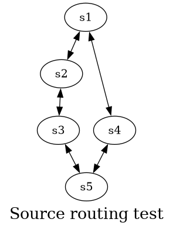
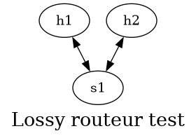
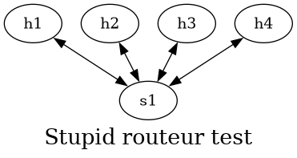
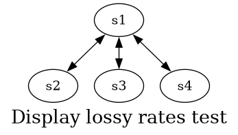

# Compte-rendu

Ce document est le compte-rendu du projet POKEMON de Nicolas Gresset-Bourgeois et Matthieu Ferreira--Rivier. Le code pour ce rapport est disponible dans ce[repository](https://github.com/NicolasGresset/POKEMON).

## Terminologie

Dans ce qui suit, les termes *switch* et *routeur* sont utilisés de manière équivalente et désignent le plan de données d'un équipement p4. Le plan de contrôle d'un équipement p4 est désigné par *contrôleur*.

## Création des équipements

### Simple router

Le code p4 et python permettant d'implémenter les fonctionnalités du simple routeur est largement repris de l'excellent repository [p4-learning](https://github.com/nsg-ethz/p4-learning) de l'ETHZ.

Au niveau du data plane, une simple logique ECMP est appliquée.

Pour le contrôleur, le code se connecte au switch et peuple les tables `ipv4_lpm`, `set_nhop` et `ecmp_group` de manière à ce que les plus courts chemins soient empruntés par les paquets.

### Routage par la source

Il s'agit ici d'ajouter une fonctionnalité de routage par la source à notre équipement simple router. Ce routage à la source permet de spécifier deux types de points de passage : 

- des liens
- des noeuds

Pour implémenter ce comportement, nous définissons un header spécialisé : 

```c
header segmemnt_t{
    ip4Addr_t target;
    bit<1> type;
    bit<1> bottom;
    bit<6> exp;
}
```

qui est localisé au niveau 2.5 (à l'instar de MPLS).

Ainsi, l'ensemble des points de passage sont définis comme une pile de `segment_t` ayant pour caractéristiques : 
  - l'adresse de passage
  - le type : lien ou noeud
  - bottom : utile au parseur pour savoir si le segment est le dernier de la pile
  - exp : champs expérimentaux garantissant d'avoir un header dont la taille est un multiple de 8 bits

> Peu importe le type de point de passage (noeud ou lien), l'adresse de passage correspond à la loopback de l'équipement concerné. C'est le champ type qui permet de faire la distinction entre les deux types et donc d'adapter la logique de traitement.


#### Vérification

Pour vérifier le fonctionnement du routage par source, on fait une expérience avec 5 switchs : on va envoyer une sonde de s1 vers s5 en spécifiant de passer par s2 et s3.
On vérifie avec des captures tcpdump le chemin emprunté par le paquet.



#### Définition d'une loopback

Pour permettre ce routage, nous avons besoin de rajouter une adresse IPv4 d'identification de chacun des routeurs. Nous décidons arbitrairement d'assigner l'adresse `100.0.0.x` au routeur `x`. La correspondance route / loopback est effectuée par le contrôleur à l'initialisation (la topologie étant statique, il suffit de renseigner cette correspondance une fois).

### Simple router loss

Le *simple router loss* est un équipement qui décide aléatoirement (probabilité de 30%) de jeter un paquet. Cette logique est entièrement implémentée dans le plan de données :

```c
action lossy_logic(){
        bit<32> random_value;
        random(random_value, (bit<32>)1, (bit<32>)100);
        if (random_value <= 30){
            standard_metadata.egress_spec = DROP_PORT;
        }
    }
```

Cette action est appelée à la fin de l'Ingress et marque le port de sortie à la valeur spéciale *DROP_PORT* = 511, ce qui indique à l'Egress de ne pas traiter ce paquet, [comme suggéré dans la documentation](https://github.com/nsg-ethz/p4-learning/wiki/BMv2-Simple-Switch#standard-metadata)).

On aurait pu simplement appeller l'action `mark_to_drop`, mais le compilateur p4run refuse un fichier source utilisant cette action de manière conditionnelle.

### Factorisation du code

D'un point de vue purement technique, nous prenons avantage de la compilation conditionnelle pour n'utiliser qu'un seul fichier source p4 quelque soit le type de routeur. 
Les fichiers sources correspondant aux routeurs stupides et lossy définissent simplement une variable qui modifiera le fichier source `p4src/simple_router.p4`.

Par exemple, `p4src/simple_router.p4` :

```c
#define DROP_PORT 511
#define LOSSY_ROUTER

#include "simple_router.p4"
```

Cette approche permet de limiter au maximum les portions de code recopiées et facilite donc le deboggage et l'ajout incrémental de fonctionnalités. 

#### Vérification

Avec une topologie simple, on vérifie avec des pings successifs que des paquets se font bien drops. On observe un taux de packet loss de 35% pour 17 paquets, ce qui confirme la correction du programme.



```bash
mininet> h1 ping h2
PING 10.0.0.2 (10.0.0.2) 56(84) bytes of data.
64 bytes from 10.0.0.2: icmp_seq=3 ttl=63 time=1.84 ms
64 bytes from 10.0.0.2: icmp_seq=4 ttl=63 time=1.81 ms
64 bytes from 10.0.0.2: icmp_seq=5 ttl=63 time=2.03 ms
64 bytes from 10.0.0.2: icmp_seq=7 ttl=63 time=2.02 ms
64 bytes from 10.0.0.2: icmp_seq=8 ttl=63 time=1.79 ms
64 bytes from 10.0.0.2: icmp_seq=9 ttl=63 time=2.27 ms
64 bytes from 10.0.0.2: icmp_seq=10 ttl=63 time=2.05 ms
64 bytes from 10.0.0.2: icmp_seq=11 ttl=63 time=2.10 ms
64 bytes from 10.0.0.2: icmp_seq=13 ttl=63 time=2.06 ms
64 bytes from 10.0.0.2: icmp_seq=14 ttl=63 time=1.96 ms
64 bytes from 10.0.0.2: icmp_seq=17 ttl=63 time=1.78 ms
^C
--- 10.0.0.2 ping statistics ---
17 packets transmitted, 11 received, 35.2941% packet loss, time 16112ms
rtt min/avg/max/mdev = 1.776/1.972/2.266/0.146 ms
```

La topologie utilisée pour ce test est `topos/lossy_router_test.json` : deux hôtes sont connectés à un switch stupide.

### Simple router stupid

Le routeur stupide est un équipement qui transmet les paquets entrants sur un port aléatoire. Cette logique n'est pas appliqué si le paquet est de type source routing et que le segment est spécifié par lien.
Pour transmettre sur un port aléatoire, le switch doit être conscient du nombre de ports auxquels il est connecté, information non nativement accessible depuis le plan de données. Cette information est donc apportée par le contrôleur à l'initialisation via un registre dédié :

```python
self.controller.register_write("number_of_ports", 0, number_of_ports)
```

puis est utilisée pour faire la transmission aléatoire :

```c
register<bit<8>>(1) number_of_ports;

action stupid_logic(){
        bit<8> number_of_port;
        bit<32> random_port;

        number_of_ports.read(number_of_port, (bit<32>) 0);
        random(random_port, (bit<32>)1, (bit<32>)number_of_port);

        standard_metadata.egress_spec = (bit<9>)(random_port);
    }
```

#### Vérification

Pour vérifier le fonctionnement de ce routeur, on peut utiliser une topologie avec 4 hôtes connectés à un switch. L'hôte h1 essaye de ping l'autre hôte h2. En enregistrant (avec tcpdump) les communications sur chaque interface s1-ethx (avec x le numéro d'hôte), on observe bien que les paquets sont transmis de manière aléatoire sur les ports de sortie du switch.



Ainsi, obtenir un ping entre h1 et h2 peut être particulièrement fastidieux, car la probabilité pour que le paquet atteigne h2 et revienne à h1 est de seulement 6.25 % (25 % * 25 %).

Le test peut être répliqué en utilisant la topologie `topos/stupid_routeur_test.json`.

```bash
mininet> h1 ping h2
PING 10.0.0.2 (10.0.0.2) 56(84) bytes of data.
64 bytes from 10.0.0.2: icmp_seq=2 ttl=63 time=1.58 ms
64 bytes from 10.0.0.2: icmp_seq=34 ttl=63 time=0.848 ms
64 bytes from 10.0.0.2: icmp_seq=52 ttl=63 time=1.10 ms
64 bytes from 10.0.0.2: icmp_seq=74 ttl=63 time=0.936 ms
64 bytes from 10.0.0.2: icmp_seq=95 ttl=63 time=1.14 ms
64 bytes from 10.0.0.2: icmp_seq=104 ttl=63 time=1.21 ms
64 bytes from 10.0.0.2: icmp_seq=109 ttl=63 time=3.00 ms
64 bytes from 10.0.0.2: icmp_seq=123 ttl=63 time=1.31 ms
64 bytes from 10.0.0.2: icmp_seq=149 ttl=63 time=1.40 ms
64 bytes from 10.0.0.2: icmp_seq=151 ttl=63 time=1.10 ms
64 bytes from 10.0.0.2: icmp_seq=157 ttl=63 time=0.932 ms
64 bytes from 10.0.0.2: icmp_seq=170 ttl=63 time=1.34 ms
64 bytes from 10.0.0.2: icmp_seq=173 ttl=63 time=1.05 ms
64 bytes from 10.0.0.2: icmp_seq=174 ttl=63 time=1.30 ms
64 bytes from 10.0.0.2: icmp_seq=189 ttl=63 time=1.13 ms
^C
--- 10.0.0.2 ping statistics ---
192 packets transmitted, 15 received, 92.1875% packet loss, time 195527ms
```

On observe un taux de pertes similaire à celui prédit, ce qui corrobore le fonctionnement attendu du switch.

## Création du méta-contrôleur

Nous avons décidé de ne pas laisser le contrôleur communiquer la topologie du réseau aux controlêurs pour des raisons de simplicité. À la place, chaque contrôleur récupère directement la topologie grâce à l'API p4utils.

Nous n'avons d'ailleurs pas ressenti le besoin d'utiliser les fonctions de l'énoncé, nous ne les avons donc pas implémenté.

## Contrôleurs

Les contrôleurs sont composés de 3 threads :

- le thread `main_loop` qui attend des ordres du méta-contrôleur (les demandes de remontée d'informations)
- le thread `probing_thread` qui envoie régulièrement des sondes au plan de données
- le thread `sniffing_digest` qui écoute en permanence des messages de type *digest* en provenance du plan de données

## Analyse du taux de pertes

### Choix personnel

L'énoncé spécifie que chaque contrôleur doit envoyer un unique paquet au plan de données pour demander l'émission de sondes vers chacun des liens sortants. Comme le plan de données n'est pas conscient, à notre connaissance, de l'identifiant (quelqu'il soit : adresse MAC, port de sortie, adresse IP) de ses voisins, cela nécessiterait de récupérer cette information auprès du contrôleur. Nous avons opté pour une stratégie différente : c'est le contrôleur qui forme préalablement les sondes et les envoie sur le port CPU où elles seront relayées par le plan de données grâce à l'encapsulation de routage par source décrite [ci-dessus](#routage-par-la-source).

### Format d'une sonde

Une sonde est constituée d'un en-tête spécifique

```c
header probe_t{
    ip4Addr_t origin;
    ip4Addr_t target;
    bit<1> fresh;
    bit<1> hit;
    bit<1> recording;
    bit<1> empty_record;
    bit<4> exp;
}
```

Ces sondes ont les caractéristiques suivantes :

- origin : Origine de la sonde (switch associé au contrôleur qui a émis la sonde)
- target : Destination de la sonde, e.g le switch à l'autre bout d'un lien local dont on veut tester le taux de pertes
- fresh : bit qui est passé à 1 lorsque la sonde quitte le routeur d'origine ; permet de distinguer un paquet provenant du contrôleur d'une sonde revenant après l'aller-retour
- hit : bit passé à 1 lorsque la sonde quitte le routeur destination
- empty_record : bit à 1 si les enregistrements de point de passage sont vides (utilise pour le parseur)
- exp : 4 bits destinés garantissant d'avoir un header dont la taille est un multiple de 8 bits 

Cette en-tête est localisée au niveau 3.5 :

```c
struct headers {
    ethernet_t   ethernet;
    segmemnt_t   sourcerouting;
    segmemnt_t[MAX_HOP] sourcerouting_stack;
    ipv4_t       ipv4;
    probe_t      probe;
    record_t[MAX_HOP] records;
    tcp_t        tcp;
}
```

### Envoi des sondes

Les sondes sont envoyées périodiquement par les contrôleurs au plan de données et sont consituées comme suit :

```python
ether = Ether(type=TYPE_SOURCEROUTING)
        segment1 = SegmentHeader(target=target, type=0, bottom=0)
        segment2 = SegmentHeader(target=origin, type=0, bottom=1)
        ip = IP(src="0.0.0.0", dst="0.0.0.0", proto=IP_PROTO_PROBE)
        probe = ProbeHeader(
            origin=origin,
            target=target,
            fresh=1,
            hit=0,
            recording=int(recording),
        )
        packet = ether / segment1 / segment2 / ip / probe
```

Une sonde est ainsi constituée de 
- deux SegmentHeaders qui indiquent au paquet de faire l'aller-retour en passant par la cible de manière relachée (en ne spécifiant que la destination).
- un ProbeHeader qui spécifie l'origine et la destination de la sonde et la nécessité d'enregistrer le chemin.

### Informations maintenues par le plan de données

Le plan de données maintient des compteurs associés à des tables qui permettent de compter le nombre de sondes parties vers une cible et le nombre de sondes revenues

```c
direct_counter(CounterType.packets) outgoing_probes;
direct_counter(CounterType.packets) incoming_probes;

table count_outgoing_probes{
    key = {
        hdr.probe.target: exact;
    }
    actions = {
        NoAction;
    }
    size = 64;
    counters = outgoing_probes;
    default_action = NoAction;
}

table count_incoming_probes{
    key = {
        hdr.probe.target: exact;
    }
    actions = {
        NoAction;
    }
    size = 64;
    counters = incoming_probes;
    default_action = NoAction;
}
```

Le contrôleur de chaque switch lit régulièrement (toutes les 10 secondes) les valeurs de ces compteurs et les stocke dans un dictionnaire indexé par le nom de la destination. Il les communique à la demande du méta-contrôleur à ce dernier par le biais d'une Queue python :

```python
def share_lossy_stats(self):
    self.queue_to_meta.put(json.dumps(self.probes_counters()))
```

### Affichage des statistiques par le méta-contrôleur

Le méta-contrôleur demande régulièrement (toutes les 10 secondes) aux contrôleurs de remonter leurs statistiques. Elles peuvent être affichées par l'utilisateur à la demande via la commande `ask_lossy_rates`.

On essaie avec la topologie suivante : 



Un affichage typique est le suivant :

```
Rates of s1 :
dest           outgoing       incoming       ratio
100.0.0.2      2              1              0.5
dest           outgoing       incoming       ratio
100.0.0.3      0              0              0
dest           outgoing       incoming       ratio
100.0.0.4      0              0              0

Rates of s2 :
dest           outgoing       incoming       ratio
100.0.0.1      0              0              0
dest           outgoing       incoming       ratio
100.0.0.3      0              0              0
dest           outgoing       incoming       ratio
100.0.0.4      0              0              0

Rates of s3 :
dest           outgoing       incoming       ratio
100.0.0.1      0              0              0
dest           outgoing       incoming       ratio
100.0.0.2      0              0              0
dest           outgoing       incoming       ratio
100.0.0.4      0              0              0

Rates of s4 :
dest           outgoing       incoming       ratio
100.0.0.1      0              0              0
dest           outgoing       incoming       ratio
100.0.0.2      0              0              0
dest           outgoing       incoming       ratio
100.0.0.3      0              0              0
```

## Analyse des plus courts chemins

On envoie maintenant des sondes qui permettent d'enregistrer le chemin pris par ces sondes.

Ces enregistrements sont sauvegardés dans un header spécifique :

```c
header record_t{
    ip4Addr_t id;
    bit<1> bottom;
    bit<7> exp;
}
```

Cet en-tête renseigne : 
- id : l'adresse traversée
- bottom : si cet en-tête est le dernier de la pile (à des fins de parsing)
- exp : 7 bits expérimentaux garantissant d'avoir un header dont la taille est un multiple de 8 bits.

## Détection et réaction

Nous n'avons pas rajouté la fonctionnalité de détection et réaction. 